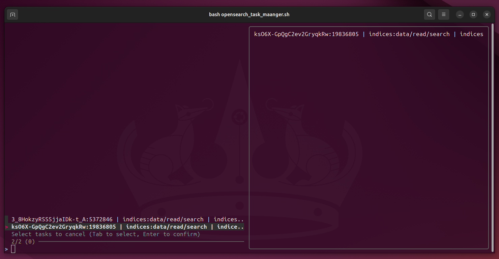

# AWS Opensearch task manager

A terminal UI to list current Opensearch Tasks with the option to cancel multiple tasks

Requirements: curl, jq, fzf

### Usage:

```
./opensearch_task_manager.sh
```


